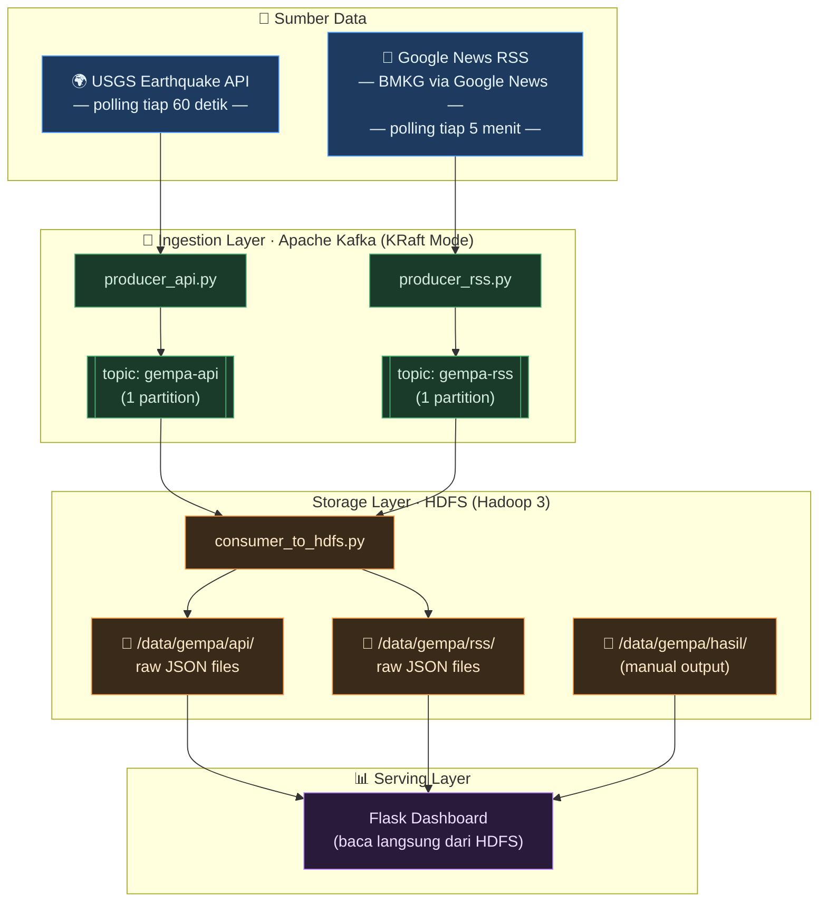
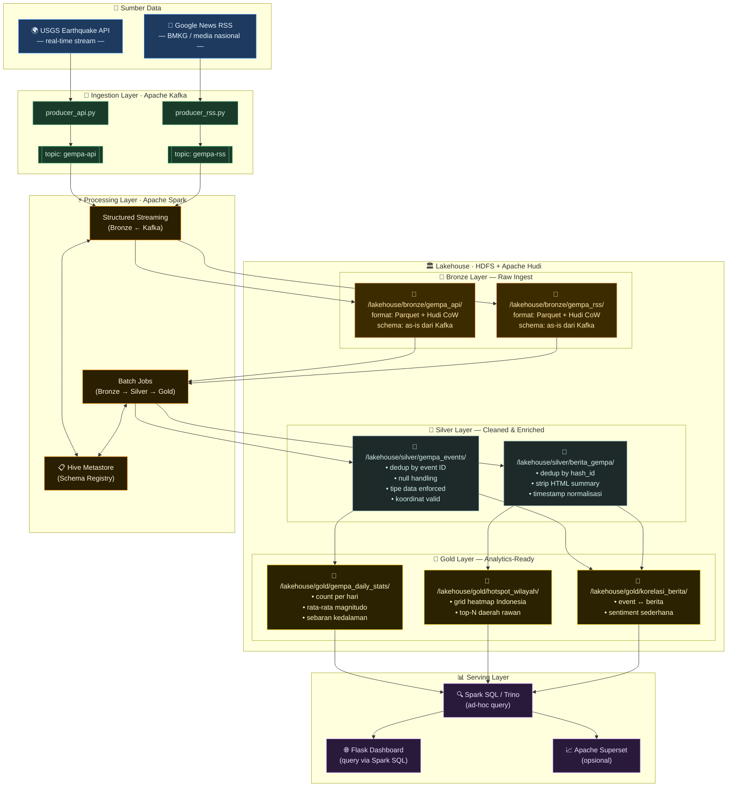
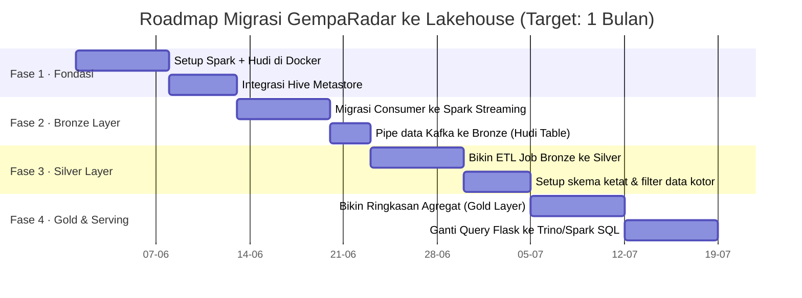

# Arsitektur Lakehouse — GempaRadar

## Arsitektur Sebelum Lakehouse
Berikut gambaran arsitektur kami sebelumnya:



###  Kondisi Infra Saat Ini

- **Ingestion:** Apache Kafka 3.9 (KRaft Mode), 2 topik dengan masing-masing 1 partisi.
- **Producers:** `producer_api.py` (polling USGS tiap menit) & `producer_rss.py` (polling RSS berita, filter pakai hash agar tidak duplikat).
- **Storage:** HDFS cluster kecil-kecilan (NameNode + DataNode di Docker).
- **Compute:** Script consumer Python biasa yang kerjanya cuma nulis raw JSON ke folder HDFS.
- **Dashboard:** Flask App yang langsung memaksa nge-read dan nge-parse ribuan file JSON dari HDFS tiap kali ada request.

---

## ✅ Arsitektur Sesudah

### Konsep Utama: Medallion Architecture + Apache Hudi

Kita bakal pakai pola **Medallion Architecture**, yaitu teknik membagi penyimpanan menjadi 3 zona tingkat kematangan data:

- **Bronze (Raw Ingest):** Tempat penampungan data mentah persis kayak yang dikirim sama Kafka. Formatnya kita ganti ke Parquet biar hemat space, tapi datanya masih kotor.
- **Silver (Cleaned & Enriched):** Data dari Bronze dibersihkan, dideduplikasi, tipe datanya disesuaikan, dan skemanya dikunci (*schema enforced*). Di sini data udah siap pakai buat analisis.
- **Gold (Business-Ready):** Data agregat hasil kalkulasi berat (misal: rata-rata magnitudo per hari, hotspot wilayah rawan). Dashboard Flask kita tinggal baca dari layer ini—auto cepet!

Biar layer-layer di atas mendukung transaksi ACID dan bisa di-update/delete layaknya tabel SQL biasa, kita pasang **Apache Hudi** di atas HDFS kita.



### Komponen Tambahan

Untuk menyokong arsitektur  ini, ada beberapa tools baru yang kami instal:

- **Apache Hudi (Copy-on-Write / Merge-on-Read):** Sebagai format tabel utama. Bertanggung jawab membuat HDFS biasa jadi punya kekuatan layaknya database SQL (bisa insert, update, delete, dan time travel).
- **Apache Spark 3.x:** Buat nge-stream data dari Kafka ke Bronze secara real-time, dan running script ETL (Extract, Transform, Load) harian ke Silver dan Gold.
- **Hive Metastore:** Bertugas sebagai pustakawan skema tabel  *(Schema Registry)*. Jadi semua metadata lokasi file dan format kolom dicatat rapi di sini.
- **Trino (dulu namanya Presto) atau Spark SQL:** Sebagai jalan pintas nge-query data pakai SQL biasa langsung menembus HDFS.

---

## Matriks Perbandingan 

| Dimensi Arsitektur | Sebelum  | Sesudah  | Status Upgrade |
|---|---|---|---|
| **Format File** | Mentah (`.json`) | Parquet + Metadata Hudi (Columnar & Padat) | 🚀 Jauh lebih hemat storage |
| **Keandalan Data** | ❌ Tidak ada jaminan ACID, rawan corrupt | ✅ Transaksi ACID via Hudi CoW/MoR | 🛡️ Sangat aman |
| **Aturan Skema** | ❌ Bebas liar, nulis apa aja masuk | ✅ Terikat ketat di Hive Metastore | 📏 Terpola rapi |
| **Deduplikasi** | Hanya sekali di level producer | Double filter (Producer + Silver Layer Upsert) | 🧹 Data bersih tanpa ganda |
| **Sejarah Data** | ❌ Hilang ditimpa data baru | ✅ Ada fitur Time Travel & Rollback | ⏳ Bisa intip masa lalu |
| **Kecepatan Query** | 🔴 Lambat  | 🟢 Cepat | ⚡ Auto-cepat |
| **Alur Pemrosesan** | Langsung taruh HDFS tanpa proses | Terbagi rapi: Bronze ➡️ Silver ➡️ Gold | 🏗️ Sangat terstruktur |
| **Kompleksitas** | 🟢 Enteng, setup cuma 5 menit | 🔴 Lumayan butuh tenaga (konfigurasi Spark) | 🧠 Menantang tapi keren |

---

## 🗺️ Rencana Migrasi

Kami matikan pipeline yang sekarang jalan



---

### 🥉 1. Menulis ke Bronze Layer (Dari Stream Kafka ke Hudi CoW)

Script consumer lama kita ganti pake Spark Streaming:

```python
# consumer_to_bronze.py
from pyspark.sql import SparkSession
from pyspark.sql.functions import col, from_json
from pyspark.sql.types import StringType

# Inisialisasi Spark Session lengkap dengan konfigurasi Hudi
spark = SparkSession.builder \
    .appName("GempaRadar-KafkaToBronze") \
    .config("spark.serializer", "org.apache.spark.serializer.KryoSerializer") \
    .config("spark.sql.extensions", "org.apache.spark.sql.hudi.HoodieSparkSessionExtension") \
    .getOrCreate()

# Baca stream data langsung dari Kafka Broker
kafka_stream = spark.readStream \
    .format("kafka") \
    .option("kafka.bootstrap.servers", "localhost:9092") \
    .option("subscribe", "gempa-api") \
    .load()

# Ubah value Kafka yang tadinya biner jadi string biasa
raw_json_df = kafka_stream.selectExpr("CAST(value AS STRING) as json_payload")

# Konfigurasi Hudi untuk nulis ke HDFS Bronze Layer
hudi_options = {
    "hoodie.table.name": "gempa_api_bronze",
    "hoodie.datasource.write.recordkey.field": "id",            # Field unik buat kunci data
    "hoodie.datasource.write.precombine.field": "timestamp",    # Buat milih data terbaru kalau ada duplikat
    "hoodie.datasource.write.table.type": "COPY_ON_WRITE",
    "hoodie.datasource.write.operation": "insert"
}

# Mulai jalankan streaming engine-nya!
query = raw_json_df.writeStream \
    .format("hudi") \
    .options(**hudi_options) \
    .option("checkpointLocation", "/lakehouse/checkpoints/gempa_api_bronze") \
    .mode("append") \
    .start("/lakehouse/bronze/gempa_api/")

query.awaitTermination()
```

### 🥈 2. Silver Layer (Pembersihan & Pengetatan Skema)

Setelah data di bronze dibersihkan dari nilai-nilai null:

```python
# etl_bronze_to_silver.py
from pyspark.sql import SparkSession
from pyspark.sql.functions import col, to_timestamp

spark = SparkSession.builder \
    .appName("GempaRadar-BronzeToSilver") \
    .getOrCreate()

# Baca data tabel Hudi dari Bronze Layer
bronze_df = spark.read.format("hudi").load("/lakehouse/bronze/gempa_api/")

# Waktunya bersih-bersih!
cleaned_df = bronze_df \
    .dropDuplicates(["id"]) \
    .filter(col("magnitude").isNotNull() & (col("magnitude") > 0.0)) \
    .withColumn("depth_km", col("depth").cast("double")) \
    .withColumn("event_time", to_timestamp(col("time_epoch") / 1000))

# Upsert (Update jika ada yang berubah, Insert jika data baru) ke Silver
hudi_upsert_options = {
    "hoodie.table.name": "gempa_events_silver",
    "hoodie.datasource.write.recordkey.field": "id",
    "hoodie.datasource.write.precombine.field": "event_time",
    "hoodie.datasource.write.operation": "upsert"               # Kekuatan utama Hudi: bisa update!
}

cleaned_df.write \
    .format("hudi") \
    .options(**hudi_upsert_options) \
    .mode("append") \
    .save("/lakehouse/silver/gempa_events/")
```

---

## 📁 Struktur Folder di HDFS Baru Kita

Nanti kalau kita SSH ke NameNode HDFS dan ketik `hdfs dfs -ls /lakehouse`, tampilannya akan seperti ini:

```
/lakehouse/
├── bronze/
│   ├── gempa_api/          ← Raw event USGS (Format Parquet + Metadata Hudi)
│   └── gempa_rss/          ← Raw berita BMKG/Media (Format Parquet + Metadata Hudi)
├── silver/
│   ├── gempa_events/       ← Data gempa bersih, udah rapi ter-skema
│   └── berita_gempa/       ← Berita bersih yang tag HTML-nya udah dibuang
└── gold/
    ├── gempa_daily_stats/  ← Tabel agregat statistik gempa harian (Dashboard read ini!)
    ├── hotspot_wilayah/    ← Hasil klasterisasi wilayah rawan gempa
    └── korelasi_berita/    ← Tabel joinan antara data kejadian gempa dengan berita media
```

---
