# 🌏 GempaRadar: Real-Time Earthquake Monitoring System
> **(Project ETS Big Data — Kelompok 1)**

GempaRadar adalah sistem monitoring gempa bumi real-time berbasis Big Data yang memantau seluruh wilayah Indonesia. Sistem ini mengumpulkan data dari USGS FDSN API dan Google News RSS, memprosesnya melalui pipeline Apache Kafka → HDFS → Apache Spark, dan menampilkannya di dashboard interaktif berbasis Flask.

---

## 📋 Daftar Isi
1. [🏗️ Arsitektur Sistem](#-arsitektur-sistem)
2. [✨ Optimalisasi & Perbaikan](#-optimalisasi--perbaikan)
3. [⚙️ Persiapan & Setup](#-persiapan--setup)
4. [🚀 Cara Menjalankan Sistem](#-cara-menjalankan-sistem)
5. [🔍 Komponen 1: Ingestion Layer (Kafka)](#-komponen-1-ingestion-layer-kafka)
6. [📂 Komponen 2: Storage Layer (HDFS)](#-komponen-2-storage-layer-hdfs)
7. [🧠 Komponen 3: Processing Layer (Spark)](#-komponen-3-processing-layer-spark)
8. [📊 Komponen 4: Serving Layer (Dashboard)](#-komponen-4-serving-layer-dashboard)
9. [🛠️ Pemeliharaan (Maintenance)](#-pemeliharaan-maintenance)

---

## 🏗️ Arsitektur Sistem

```
USGS FDSN API ──┐
                ├──► Kafka (gempa-api) ──┐
Google News RSS ┘                        ├──► HDFS ──► Spark ──► spark_results.json
                ──► Kafka (gempa-rss) ──┘                              │
                                                                        ▼
                                                              Flask Dashboard (Port 5000)
                                                              + Live USGS refresh (tiap 5 mnt)
```

**Stack teknologi:**
- **Apache Kafka** (kafka-python-ng) — message broker, 2 topic: `gempa-api` & `gempa-rss`
- **Apache Hadoop HDFS** — penyimpanan file JSON terpartisi per waktu
- **Apache Spark 3.5.0** + **PySpark MLlib** — batch analytics & linear regression
- **Flask + Leaflet.js** — dashboard web interaktif

---

## ✨ Optimalisasi & Perbaikan

### 1. Fix DNS `kafka-broker` di Windows Host
Kafka broker mengembalikan metadata dengan hostname internal Docker (`kafka-broker:9092`), yang tidak bisa di-resolve dari Windows. Solusi tanpa mengubah `hosts` file atau restart Docker: **socket monkey-patch** di Python.

Patch ini ditambahkan di awal semua script Kafka (`producer_api.py`, `producer_rss.py`, `consumer_to_hdfs.py`):

```python
import socket
_orig_getaddrinfo = socket.getaddrinfo
def _patched_getaddrinfo(host, port, *args, **kwargs):
    if host == 'kafka-broker':
        host = '127.0.0.1'
    return _orig_getaddrinfo(host, port, *args, **kwargs)
socket.getaddrinfo = _patched_getaddrinfo
```

### 2. Otomatisasi Spark dengan `spark_runner.py`
Sebelumnya Spark harus dijalankan manual dengan perintah `docker exec spark-master spark-submit ...` setiap kali ingin memperbarui analisis. Sekarang cukup jalankan `spark_runner.py` sekali — ia akan otomatis menjalankan Spark job setiap **10 menit**.

```python
# Konfigurasi di spark_runner.py
INTERVAL_MINUTES = 10   # ubah sesuai kebutuhan
```

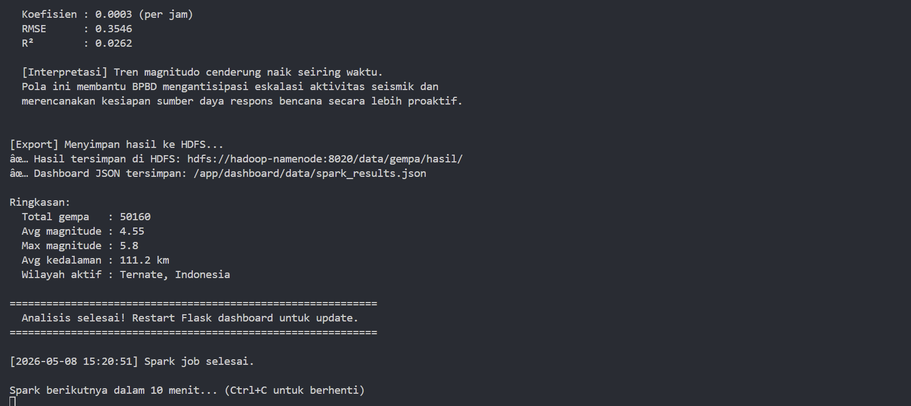

### 3. Pembersihan RSS Feed Mati
Empat sumber RSS (Detik, Kompas, Tempo, Liputan6) mengembalikan error 404 atau XML tidak valid. Keempat sumber dihapus, diganti dengan satu sumber Google News yang stabil:
```
https://news.google.com/rss/search?q=gempa+indonesia&hl=id&gl=ID&ceid=ID:id
```

### 4. Fix Bug: Pin Peta 2D Tab "Berpotensi Tsunami" Tidak Muncul
Tab "Berpotensi Tsunami" menampilkan 0 titik meskipun ada gempa yang seharusnya termasuk (contoh: M5.7 Gunungsitoli kedalaman 18 km). Penyebabnya: tiga bagian kode (`filterByTab`, `showDetailCard`, `renderSidebar`) menggunakan kondisi tsunami yang **berbeda-beda dan tidak konsisten**.

**Solusi**: membuat satu fungsi terpusat `isTsunami(g)` yang digunakan di semua bagian:

```javascript
function isTsunami(g) {
  const m = g.magnitude || 0, d = g.depth_km || 999;
  // tsunami flag dari USGS, ATAU M>=6 kedalaman<100km, ATAU M>=5.5 kedalaman<50km
  return g.tsunami == 1 || (m >= 6.0 && d < 100) || (m >= 5.5 && d < 50);
}
```

### 5. Penghapusan Konfigurasi Delta Lake
Delta Lake library (`io.delta`) tidak tersedia di container Spark, menyebabkan `ClassNotFoundException` yang menggagalkan semua job. Konfigurasi Delta dihapus dari `SparkSession` karena tidak dibutuhkan untuk analisis utama.

---

## ⚙️ Persiapan & Setup

### Prasyarat
- Docker Desktop terinstal dan berjalan
- Python 3.10+ dengan virtual environment
- Git (untuk clone repository)

### Langkah 1: Install Python Dependencies
```sh
pip install -r requirements.txt
```

### Langkah 2: Konfigurasi `hosts` File
Hadoop Datanode membutuhkan resolusi DNS dari luar Docker. Buka **Notepad** sebagai **Administrator**, edit `C:\Windows\System32\drivers\etc\hosts`, tambahkan:
```
127.0.0.1 datanode
```

### Langkah 3: Jalankan Docker Containers (urutan wajib)
```sh
# 1. Hadoop terlebih dahulu
docker compose -f docker-compose-hadoop.yml up -d

# 2. Kafka
docker compose -f docker-compose-kafka.yml up -d

# 3. Spark
docker compose -f docker-compose-spark.yml up -d
```

Verifikasi semua container berjalan:

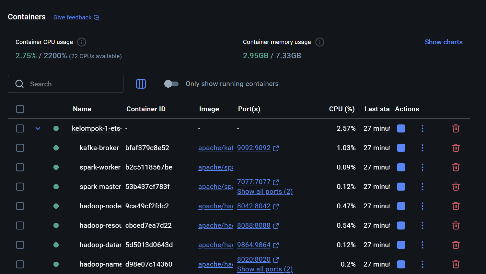

### Langkah 4: Buat Kafka Topics (hanya pertama kali)
```sh
docker exec -it kafka-broker /opt/kafka/bin/kafka-topics.sh \
  --create --topic gempa-api --bootstrap-server localhost:9092 \
  --partitions 1 --replication-factor 1

docker exec -it kafka-broker /opt/kafka/bin/kafka-topics.sh \
  --create --topic gempa-rss --bootstrap-server localhost:9092 \
  --partitions 1 --replication-factor 1
```

### Langkah 5: Buat Struktur Direktori HDFS (hanya pertama kali)
```sh
docker exec -it hadoop-namenode hdfs dfs -mkdir -p /data/gempa/api/
docker exec -it hadoop-namenode hdfs dfs -mkdir -p /data/gempa/rss/
docker exec -it hadoop-namenode hdfs dfs -mkdir -p /data/gempa/hasil/
docker exec -it hadoop-namenode hdfs dfs -chmod -R 777 /data
```

---

## 🚀 Cara Menjalankan Sistem

Jalankan **masing-masing script di terminal terpisah** dari folder root proyek.

### Terminal 1 — Producer API (USGS)
```sh
cd kafka
python producer_api.py
```
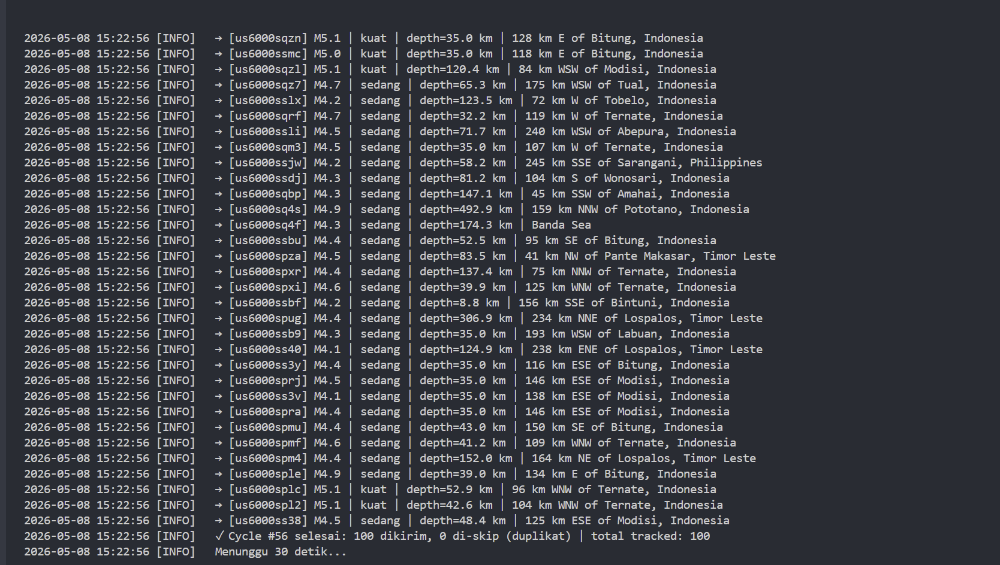

Script ini polling USGS FDSN API setiap 30 detik, mengambil 100 event gempa terbaru di area Indonesia (bounding box lat -11 s/d 6, lon 95 s/d 141), dan mengirimkan setiap event sebagai pesan JSON ke topic `gempa-api`.

### Terminal 2 — Producer RSS (Google News)
```sh
cd kafka
python producer_rss.py
```
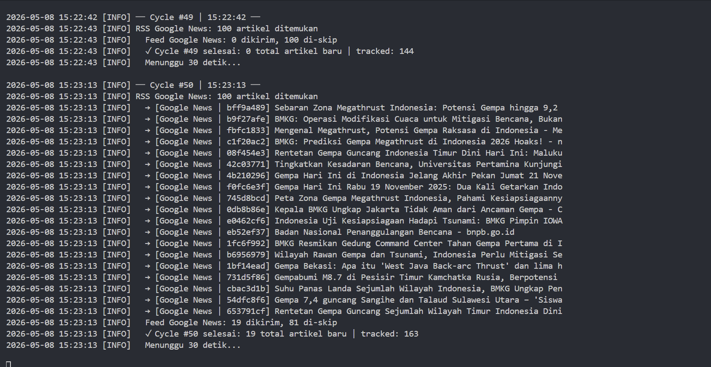

Script ini polling Google News RSS setiap 30 detik, mem-parse artikel dengan `feedparser`, dan mengirim berita baru (deduplikasi via hash URL) ke topic `gempa-rss`.

### Terminal 3 — Consumer to HDFS
```sh
cd kafka
python consumer_to_hdfs.py
```
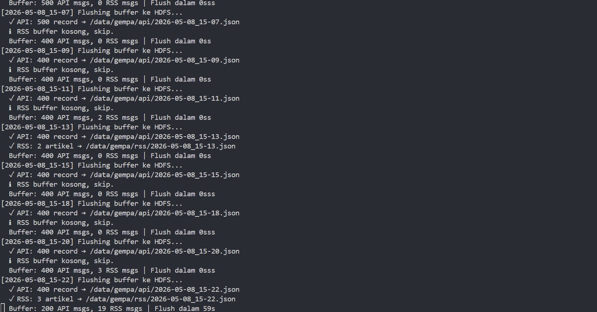

Consumer membaca kedua topic Kafka dan mengakumulasi data di buffer memori. Setiap **2 menit**, buffer di-flush ke HDFS sebagai file JSON dengan timestamp (contoh: `/data/gempa/api/2026-05-08_15-00.json`) sekaligus disimpan lokal ke `dashboard/data/live_api.json`.

### Terminal 4 — Spark Auto Runner
```sh
cd kafka
python spark_runner.py
```


`spark_runner.py` menjalankan `spark_processing.py` via `docker exec` ke container `spark-master` langsung saat dijalankan, lalu mengulang setiap 10 menit secara otomatis. Output analisis mencakup:
- Distribusi magnitudo (Mikro / Minor / Sedang / Kuat)
- Top 10 wilayah paling aktif
- Distribusi & statistik kedalaman
- MLlib Linear Regression (prediksi tren magnitudo)

Hasil disimpan ke `dashboard/data/spark_results.json` untuk ditampilkan di dashboard.

### Terminal 5 — Flask Dashboard
```sh
cd dashboard
python app.py
```
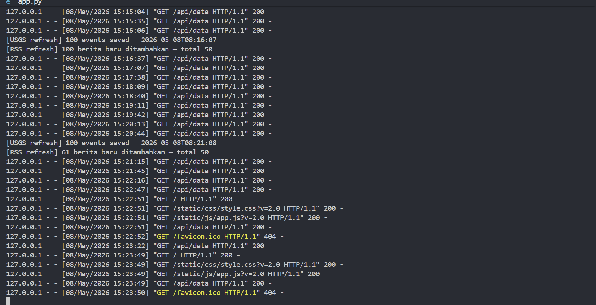

Dashboard tersedia di **http://localhost:5000**. Flask juga menjalankan background thread yang me-refresh data langsung dari USGS setiap 5 menit sebagai lapisan pelengkap pipeline Kafka.

---

## 🔍 Komponen 1 — Apache Kafka: Ingestion Layer

### Producer API (`producer_api.py`)
- **Sumber data**: USGS FDSN API (`earthquake.usgs.gov/fdsnws`)
- **Interval polling**: 30 detik
- **Topic tujuan**: `gempa-api`
- **Format pesan**:
  ```json
  {
    "id": "us7000sgql",
    "source": "usgs_api",
    "event_time": "2026-05-08T07:00:00+00:00",
    "event_time_epoch": 1746684000000,
    "magnitude": 4.1,
    "magnitude_type": "mb",
    "depth_km": 10.0,
    "latitude": -1.24,
    "longitude": 123.69,
    "place": "105 km ESE of Luwuk, Indonesia",
    "tsunami": 0,
    "felt": null,
    "sig": 259
  }
  ```

### Producer RSS (`producer_rss.py`)
- **Sumber data**: Google News RSS (`news.google.com/rss/search?q=gempa+indonesia`)
- **Interval polling**: 30 detik
- **Topic tujuan**: `gempa-rss`
- **Deduplication**: hash 8 karakter dari URL artikel

### Kendala & Solusi RSS
| Sumber | Masalah | Status |
|--------|---------|--------|
| BMKG | Migrasi ke XML murni, tidak kompatibel `feedparser` | Dihapus |
| Detik | HTTP 404 | Dihapus |
| Kompas | XML tidak valid | Dihapus |
| Tempo | Menghapus endpoint RSS per-tag | Dihapus |
| Liputan6 | HTTP 404 | Dihapus |
| **Google News** | Stabil, selalu tersedia | **Digunakan** |

### Verifikasi Kafka
```sh
# Cek topic yang ada
docker exec -it kafka-broker /opt/kafka/bin/kafka-topics.sh \
  --list --bootstrap-server localhost:9092

# Monitor pesan masuk real-time
docker exec -it kafka-broker /opt/kafka/bin/kafka-console-consumer.sh \
  --topic gempa-api --from-beginning --bootstrap-server localhost:9092
```

---

## 📂 Komponen 2 — HDFS: Storage Layer

### Consumer (`consumer_to_hdfs.py`)
Consumer menggunakan `assign()` + `seek_to_beginning()` (bukan `subscribe()`) untuk menghindari bug `kafka-python-ng` pada Python 3.13 Windows terkait `Invalid file descriptor: -1`.

**Alur kerja:**
1. Assign ke `TopicPartition('gempa-api', 0)` dan `TopicPartition('gempa-rss', 0)`
2. `seek_to_beginning()` — baca semua pesan dari awal
3. Akumulasi di buffer memori
4. Setiap 120 detik: flush ke HDFS + simpan lokal ke `dashboard/data/`
5. Commit offset ke broker

**Struktur penyimpanan HDFS:**
```
/data/gempa/
├── api/
│   ├── 2026-05-08_15-00.json   (~100-200 record per file)
│   ├── 2026-05-08_15-02.json
│   └── ...
├── rss/
│   ├── 2026-05-08_15-00.json
│   └── ...
└── hasil/
    └── (output Spark)
```

### Verifikasi HDFS
```sh
# Cek isi direktori
docker exec -it hadoop-namenode hdfs dfs -ls -R /data/gempa/

# Cek ukuran data
docker exec -it hadoop-namenode hdfs dfs -du -h /data/gempa/api/

# Baca file tertentu
docker exec -it hadoop-namenode hdfs dfs -cat /data/gempa/api/2026-05-08_15-00.json
```

**Web UI HDFS**: http://localhost:9870

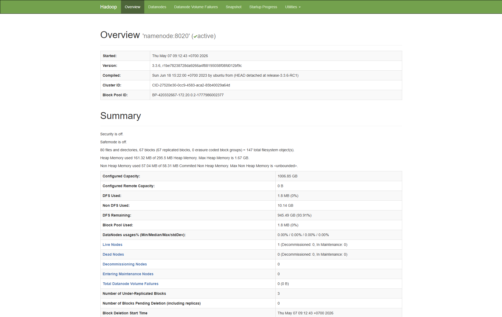

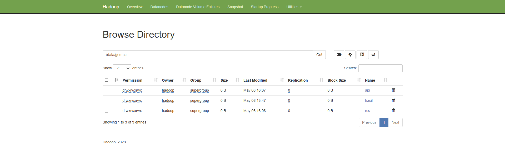

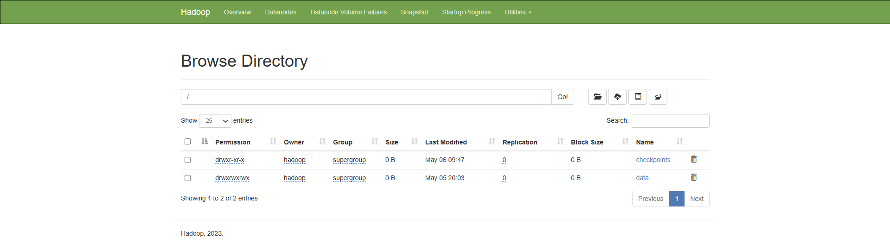

> [!IMPORTANT]
> Pastikan baris `127.0.0.1 datanode` ada di `C:\Windows\System32\drivers\etc\hosts` (buka Notepad sebagai Administrator).

---

## 🧠 Komponen 3 — Apache Spark: Processing Layer

### `spark_processing.py`
Script analisis batch yang membaca semua file JSON dari HDFS dan menghasilkan 3 analisis wajib + 1 bonus MLlib.

**Konfigurasi SparkSession:**
```python
spark = SparkSession.builder \
    .appName("GempaRadar-Analysis") \
    .master("spark://spark-master:7077") \
    .config("spark.hadoop.fs.defaultFS", "hdfs://hadoop-namenode:8020") \
    .getOrCreate()
```

### Analisis yang Dilakukan

**A. Distribusi Magnitudo** (DataFrame API)
```
+------------+-----+
|kategori_mag|count|
+------------+-----+
|Sedang (4-5)|37544|
|   Kuat (>5)| 6116|
+------------+-----+
```

**B. Top 10 Wilayah Paling Aktif** (Spark SQL)
```
+-----------------------+------------+--------+-------------+
|wilayah                |jumlah_gempa|rata_mag|rata_depth_km|
+-----------------------+------------+--------+-------------+
|Ternate, Indonesia     |6946        |4.61    |48.6         |
|Bitung, Indonesia      |4356        |4.71    |35.8         |
|Lospalos, Timor Leste  |3933        |4.39    |189.0        |
+-----------------------+------------+--------+-------------+
```

**C. Distribusi & Statistik Kedalaman** (Spark SQL)
```
+-------+--------+-----+---------------+---------+---------+
|dangkal|menengah|dalam|rata_rata_depth|depth_max|depth_min|
+-------+--------+-----+---------------+---------+---------+
|  24407|   15284| 3969|          111.4|    603.8|     10.0|
+-------+--------+-----+---------------+---------+---------+
```

**D. MLlib Linear Regression (Bonus +5)**
```
  Koefisien : 0.0003 (per jam)
  RMSE      : 0.3547
  R2        : 0.0289
  Tren      : Magnitudo cenderung naik seiring waktu
```

### `spark_runner.py` — Otomatisasi
```sh
python spark_runner.py
```

Runner ini langsung menjalankan Spark job saat pertama kali dijalankan, lalu mengulang setiap 10 menit. Ubah `INTERVAL_MINUTES` di baris pertama file jika ingin interval berbeda.

**Web UI Spark Master**: http://localhost:8080

---

## 📊 Komponen 4 — Dashboard: Serving Layer

### Tampilan Dashboard

**Peta 2D Interaktif:**

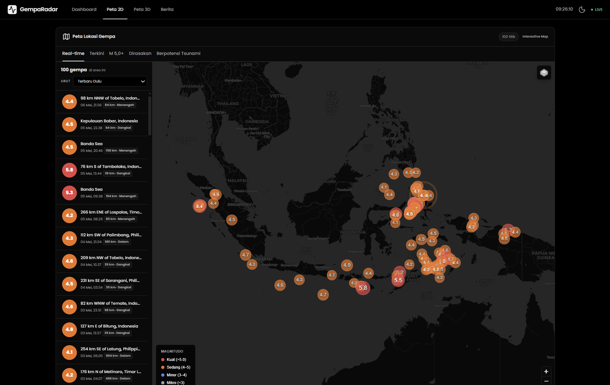

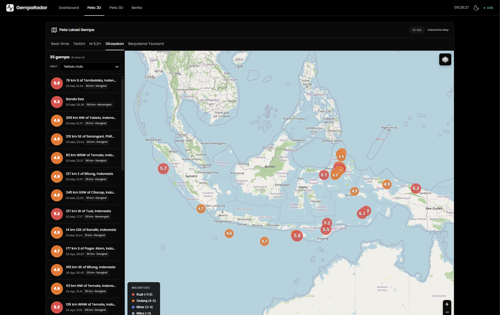

**Peta 3D Globe:**

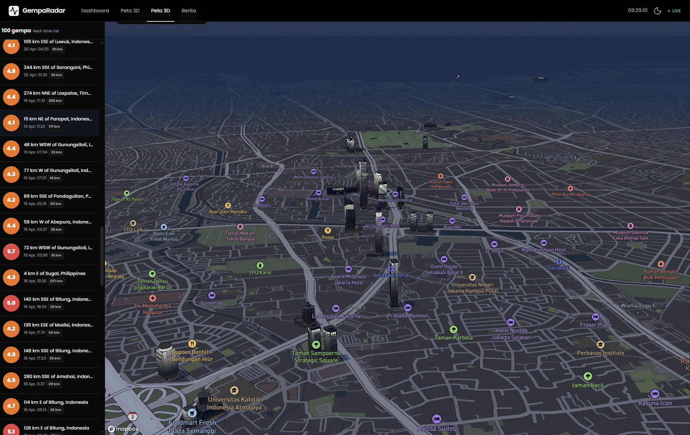

**Berita Gempa dari RSS:**

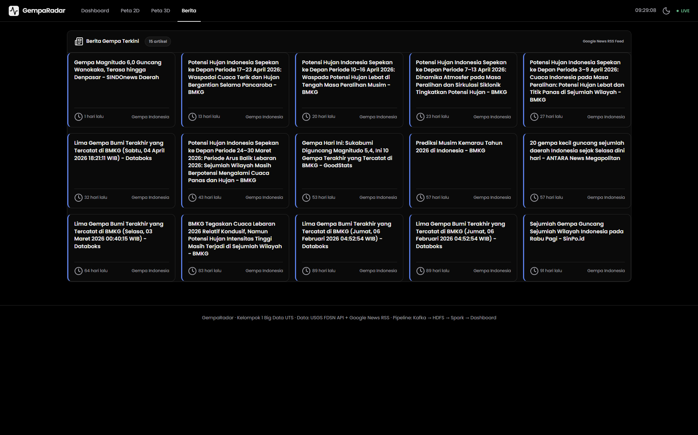

### Fitur Dashboard
| Tab / Fitur | Deskripsi |
|-------------|-----------|
| **Real-time** | Semua gempa terkini dari USGS (max 100 event) |
| **Terkini** | 1 gempa terbaru dengan detail lengkap |
| **M 5.0+** | Filter gempa kuat saja |
| **Dirasakan** | Gempa yang dilaporkan dirasakan masyarakat |
| **Berpotensi Tsunami** | Gempa dengan `tsunami=1` ATAU `M>=6 & depth<100km` ATAU `M>=5.5 & depth<50km` |
| **Peta 3D Globe** | Visualisasi globe interaktif dengan Mapbox |
| **Statistik Spark** | Hasil analisis batch dari HDFS (diperbarui tiap 10 menit) |
| **Berita** | Artikel gempa dari Google News RSS |

### Menjalankan Dashboard
```sh
cd dashboard
python app.py
```

Akses di **http://localhost:5000**

---

## 🛠️ Pemeliharaan (Maintenance)

### Mematikan Semua Layanan
```sh
docker compose -f docker-compose-spark.yml down
docker compose -f docker-compose-kafka.yml down
docker compose -f docker-compose-hadoop.yml down
```

### Menyalakan Ulang (Urutan wajib: Hadoop → Kafka → Spark)
```sh
docker compose -f docker-compose-hadoop.yml up -d
docker compose -f docker-compose-kafka.yml up -d
docker compose -f docker-compose-spark.yml up -d
```

Setelah Docker siap, jalankan 5 script Python di terminal masing-masing:
```sh
# Terminal 1
python kafka/producer_api.py

# Terminal 2
python kafka/producer_rss.py

# Terminal 3
python kafka/consumer_to_hdfs.py

# Terminal 4
python kafka/spark_runner.py

# Terminal 5
python dashboard/app.py
```

### Cek Status Container
```sh
docker ps
```
Semua container berikut harus berstatus `Up`: `kafka-broker`, `spark-master`, `spark-worker`, `hadoop-namenode`, `hadoop-datanode`, `hadoop-resourcemanager`, `hadoop-nodemanager`.

---

> **Kelompok 1 — Big Data ETS**
> *Working hard to monitor every shake.*
