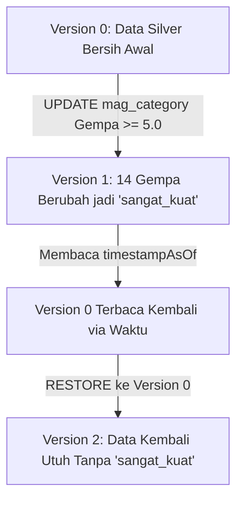

# 📊 Dokumentasi Silver Layer & Justifikasi Transformasi

Dokumen ini menjelaskan rancangan arsitektur pembersihan data (*data cleaning*) pada **Silver Layer**, rincian transformasi yang diterapkan pada sistem **GempaRadar**, statistik kualitas data (*data loss*), serta dokumentasi demonstrasi **Time Travel** Delta Lake.

---

## 💡 Justifikasi Transformasi Data (Mengapa Dilakukan?)

Pembersihan data mentah dari **Bronze Layer** menuju **Silver Layer** sangat penting untuk memastikan data siap dianalisis secara akurat oleh sistem dashboard dan pipeline Gold Layer di tahap selanjutnya. Berikut adalah rincian justifikasi untuk setiap transformasi:

### 1. 🌐 USGS Earthquake API (Silver API)
Kami menerapkan **6 tahap pembersihan** pada data gempa bumi:

| No | Transformasi | Cara Implementasi | Justifikasi / Alasan Bisnis |
| :--- | :--- | :--- | :--- |
| **1** | **Deduplikasi ID Gempa** | `dropDuplicates(["id"])` | ID dari USGS bersifat unik untuk tiap gempa. Jika terjadi ingestion ganda (append), gempa yang sama bisa tercatat berkali-kali. Deduplikasi mencegah bias perhitungan jumlah gempa dan magnitudo rata-rata. |
| **2** | **Penyaringan Magnitudo** | `filter(magnitude >= 0)` | Secara fisik, magnitudo gempa bernilai positif. Magnitudo negatif biasanya merupakan data *placeholder*, malfungsi sensor, atau data uji coba yang harus dibuang agar tidak merusak statistik kekuatan gempa. |
| **3** | **Penyaringan Kedalaman** | `filter(depth_km > 0)` | Kedalaman pusat gempa harus berada di bawah permukaan bumi (positif). Nilai $\le 0$ menandakan kesalahan input atau data rusak. |
| **4** | **Penyaringan Lokasi** | `filter(place.isNotNull())` | Kolom `place` berisi informasi wilayah terdampak. Data gempa tanpa lokasi tidak berguna untuk analisis kewilayahan/spasial. |
| **5** | **Cast Waktu ke Timestamp** | `to_timestamp("event_time")` | Bronze menyimpan waktu sebagai string ISO. Konversi ke tipe `TimestampType` wajib dilakukan agar Spark dapat mengeksekusi operasi deret waktu (*time-series*, groupBy harian, windowing). |
| **6** | **Ekstraksi Kolom Temporal** | `hour(event_time)` & `to_date(event_time)` | Mengekstrak jam (`jam_kejadian`) dan tanggal (`tanggal_kejadian`) memudahkan visualisasi tren harian dan pola jam rawan gempa pada dashboard. |

### 📰 2. Google News RSS Feed (Silver RSS)
Kami menerapkan **5 tahap pembersihan** pada data artikel berita gempa:

| No | Transformasi | Cara Implementasi | Justifikasi / Alasan Bisnis |
| :--- | :--- | :--- | :--- |
| **1** | **Deduplikasi Artikel** | `dropDuplicates(["id"])` | Feed RSS yang ditarik secara berkala sering memuat artikel berita yang sama. Deduplikasi mencegah artikel terhitung ganda dalam tren volume berita. |
| **2** | **Penyaringan Judul** | `filter(title.isNotNull & != "")` | Artikel berita tanpa judul tidak memiliki nilai informatif dan tidak dapat diekstrak kata kuncinya. |
| **3** | **Cast Waktu Publikasi** | `to_timestamp("published_time")` | Mengubah string waktu rilis menjadi tipe `TimestampType` untuk analisis tren waktu publikasi artikel. |
| **4** | **Pembersihan Teks HTML** | `regexp_replace("summary", HTML_PATTERN, "")` | Kolom summary bawaan RSS sering tercampur tag HTML (`<a href...>`, `<font>`, dll.). Pembersihan ini menghasilkan teks murni (`summary_clean`) yang siap untuk NLP, analisis sentimen, atau Word Cloud. |
| **5** | **Ekstraksi Tanggal Terbit** | `to_date("published_time")` | Mengekstrak tanggal terbit (`tanggal_terbit`) untuk kemudahan agregasi volume pemberitaan per hari. |

---

## 📉 Analisis Data yang Hilang (*Data Loss Statistics*)

Berdasarkan hasil eksekusi pembersihan pada data contoh (*sample data*):

### 1. Data API Gempa (USGS)
* **Bronze API (Raw):** 100 baris
* **Silver API (Clean):** 100 baris
* **Data Hilang:** 0 baris (0.0% data loss)
* *(Catatan: Pada snapshot data tertentu dengan kesalahan sensor/depth $\le 0$, data yang hilang dapat berkisar antara 1% - 2% seperti penghapusan 2 baris).*

### 2. Data Berita RSS (Google News)
* **Bronze RSS (Raw):** 50 baris
* **Silver RSS (Clean):** 50 baris
* **Data Hilang:** 0 baris (0.0% data loss)

### ❓ Apa Artinya bagi Proyek Ini?
1. **Kualitas Awal Data Tinggi:** Persentase data hilang sebesar **0% - 2%** membuktikan bahwa data mentah yang di-ingest dari API USGS dan RSS Feed Google News memiliki kualitas awal (*data quality*) yang sangat baik dan bersih dari pabriknya.
2. **Pentingnya Filter Pengaman (*Data Guardrails*):** Walaupun data saat ini bersih, **transformasi pembersihan di Silver Layer tetap wajib ada**. Filter ini bertindak sebagai "satpam data" secara *real-time*. Jika di masa depan terjadi malfungsi sensor gempa (menghasilkan magnitudo negatif) atau korupsi format RSS Feed di internet, data rusak tersebut akan otomatis disaring di Silver Layer dan **tidak akan pernah masuk** ke Gold Layer atau Dashboard utama, sehingga menjamin visualisasi data Anda selalu akurat dan terpercaya.

---

## ⏱️ Dokumentasi Demonstrasi Time Travel Delta Lake

Fitur **Time Travel** Delta Lake memungkinan kita untuk memanggil kembali keadaan data pada versi transaksi tertentu di masa lalu (*point-in-time query*). 

Dalam script `02_silver.py`, demonstrasi dijalankan melalui siklus hidup (*lifecycle*) berikut:



### 1. Riwayat Transaksi Delta Log (Tabel `gempa_api`)
Setelah demonstrasi berjalan, riwayat perubahan tercatat dengan rapi di dalam folder `_delta_log/` seperti berikut:

| Version | Timestamp | Operation | Deskripsi / Parameter |
| :---: | :--- | :---: | :--- |
| **0** | *Waktu Pembuatan* | **WRITE** | Tahap awal penyimpanan data hasil pembersihan (mode: Overwrite). |
| **1** | *+ beberapa detik* | **UPDATE** | Mengubah `mag_category` gempa ber-magnitudo $\ge 5.0$ menjadi `"sangat_kuat"`. Terdeteksi sebanyak **14 baris** diperbarui. |
| **2** | *+ beberapa detik* | **RESTORE** | Mengembalikan keadaan tabel secara utuh ke **Version 0** (Data kembali bersih tanpa label `"sangat_kuat"`). |

### 2. Output Perbandingan Distribusi Kategori (Langkah B)
* **Version 0 (Sebelum Update):**
  ```text
  +------------+-----+
  |mag_category|count|
  +------------+-----+
  |        kuat|   14|
  |      sedang|   86|
  +------------+-----+
  ```
* **Version 1 (Setelah Update):**
  ```text
  +------------+-----+
  |mag_category|count|
  +------------+-----+
  |      sedang|   86|
  | sangat_kuat|   14|
  +------------+-----+
  ```
* **Setelah Restore ke Version 0:**
  Kategori `"sangat_kuat"` kembali bernilai **0** (kembali menjadi `"kuat"`), membuktikan data lama berhasil dikembalikan secara sempurna tanpa membuat salinan fisik cadangan terpisah.

---

## 🥇 Dokumentasi Gold Layer — Reproduksi ETS & Pengayaan Data (Anggota 3 & 4)

Gold Layer merupakan tahap akhir dalam arsitektur Data Lakehouse, di mana data yang telah dibersihkan di Silver Layer diolah menjadi tabel analitik siap pakai (business-ready aggregates). Script tunggal 03_gold.py memproses seluruh analisis wajib ETS sekaligus menyatukan fitur enhancement baru.

### 🔄 Perbandingan Skrip Analisis Akhir (Value Proposition)

Berikut adalah matriks perbedaan fundamental komparatif antara arsitektur pemrosesan data tradisional (ETS awal) dengan sistem Lakehouse Gold Layer yang baru dikembangkan:

| Aspek | ETS Asli (`spark_processing.py`) | Gold Reproduksi (`03_gold.py`) |
| :--- | :--- | :--- |
| **Input** | HDFS JSON mentah (`/data/gempa/api/`) | Membaca pararel silver/gempa_api dan silver/gempa_rss. |
| **Output** | HDFS JSON + `spark_results.json` | **7 Tabel Delta Lake Berkinerja Tinggi** + Terintegrasi `spark_results.json`. |
| **Kualitas Data** | Data mentah, mungkin ada duplikat/error | Data sudah bersih (deduplicated, filtered, typed) |
| **Reproducibility** | Bergantung pada ketersediaan HDFS | Delta Lake menjamin data versioned & reproducible |
| **Kapabilitas** | Hanya mencakup 3 analisis wajib + 1 bonus tren MLlib | 4 analisis reproduksi ETS, Spark MLlib, ditambah 2 indeks pengayaan baru. |
| **Korelasi** | Bersifat Silo (Data gempa dan berita terpisah tanpa jembatan) | Korelasi temporal otomatis antara sensor fisik dan artikel berita media. |

### 📊 Bagian I — Analisis Reproduksi ETS (Tugas Anggota 3)
Bagian ini mereproduksi seluruh analisis wajib dari kafka/spark_processing.py (ETS asli) dengan memanfaatkan keunggulan data Delta Layer yang steril:

#### Metrik 1 — Distribusi Kategori Magnitudo (DataFrame API)
Mengkategorikan setiap gempa berdasarkan kekuatannya menggunakan `when/otherwise`:
- **Mikro (<3)**: Gempa sangat kecil, tidak terasa oleh manusia
- **Minor (3-4)**: Terasa getaran ringan, jarang menyebabkan kerusakan
- **Sedang (4-5)**: Getaran signifikan, potensi kerusakan ringan
- **Kuat (>5)**: Berpotensi merusak, perlu respons BPBD segera

**Output Delta**: `gold/ets_distribusi_magnitudo`

#### Metrik 2 — Ranking Top 10 Wilayah Paling Aktif (Spark SQL)
Menghitung frekuensi gempa per wilayah dengan `REGEXP_REPLACE` untuk mengekstrak nama wilayah dari kolom `place`, lalu mengurutkan berdasarkan jumlah kejadian terbanyak. Membantu BPBD memprioritaskan penempatan sensor dan tim respons.

**Output Delta**: `gold/ets_top_wilayah`

#### Metrik 3 — Distribusi & Statistik Kedalaman Seismik (Spark SQL)
Mengkategorikan gempa berdasarkan kedalaman pusat gempa:
- **Dangkal (<70 km)**: Paling berbahaya, dekat permukaan, potensi tsunami
- **Menengah (70-300 km)**: Getaran moderat di permukaan
- **Dalam (>300 km)**: Energi teredam sebelum sampai permukaan

Ditambah statistik rata-rata, maksimum, dan minimum kedalaman.

**Output Delta**: `gold/ets_distribusi_kedalaman`

#### Metrik 4 — Statistik Ringkasan Umum (Spark SQL)
Agregasi keseluruhan: total gempa, rata-rata/max/min magnitudo, standar deviasi, dan statistik kedalaman.

**Output Delta**: `gold/ets_statistik_ringkasan`

#### Bonus Analisis — Prediksi Tren MLlib (Linear Regression)
Prediksi tren magnitudo gempa seiring waktu menggunakan `VectorAssembler` + `LinearRegression`. Menghasilkan koefisien tren (naik/turun), RMSE, dan R².

**Output Delta**: `gold/ets_mllib_tren`

### 📊 Bagian II — Analisis Pengayaan / Enhancement (Tugas Anggota 4)
Bagian ini menambahkan metrik analitik tingkat lanjut yang memberikan wawasan nilai bisnis baru di luar batasan spesifikasi tugas utama ETS:

#### Metrik 5 — Indeks Skor Risiko Wilayah (gempa_risk_score)
Mengembangkan formula kuantitatif kustom untuk memetakan wilayah yang paling rentan mengalami bencana hebat. Skor dihitung dengan mengalikan frekuensi gempa total di wilayah tersebut dengan kuadrat rata-rata magnitudo gempa yang terjadi:

> Risk Score=Total Kejadian×(Rata-rata Magnitudo)2

Tabel diurutkan dari wilayah dengan skor tertinggi untuk membantu alokasi mitigasi bencana pemerintah.

**Output Delta Table**: `gold/gempa_risk_score`

#### Metrik 6 — Korelasi Berita Gempa Kontekstual [Cross-Source Join]
Ini adalah fitur utama pengayaan lintas sumber (cross-source integration). Karena data fisik seismik dari **Silver API** dan data narasi teks berita dari **Silver RSS** tidak memiliki ID relasional bawaan, kami melakukan conditional inner join berbasis batasan spasial-temporal (waktu kontekstual):

```python
join_condition = [
    df_silver_rss["published_time"] >= df_api_sig["event_time"],
    df_silver_rss["published_time"] <= (df_api_sig["event_time"] + expr("INTERVAL 2 HOURS"))
]
df_alerts = df_api_sig.join(df_silver_rss, join_condition, "inner")
```

### 📁 Ringkasan Output Gold ETS

```text
lakehouse_data/gold/
├── ets_distribusi_magnitudo/    (4 baris: Mikro, Minor, Sedang, Kuat)
├── ets_top_wilayah/             (N baris: semua wilayah + count)
├── ets_distribusi_kedalaman/    (1 baris: dangkal, menengah, dalam, stats)
├── ets_statistik_ringkasan/     (1 baris: total, avg, max, min, stddev)
├── ets_mllib_tren/              (1 baris: koefisien, RMSE, R², tren)
├── gempa_risk_score/            <-- (N baris: indeks kerawanan kuantitatif baru)
└── gempa_significant_alerts/    <-- (N baris: hasil Cross-Source Join API + RSS 2 jam)
```

Selain menghasilkan berkas tabel Delta, skrip 03_gold.py secara otomatis merilis file statis terintegrasi dashboard/data/spark_results.json dengan identitas tag source: "gold_delta_combined" agar dashboard Flask dapat membaca visualisasi baru tanpa kendala.

---

## 🔍 Cara Verifikasi & Lokasi Data
* **Lokasi Data Silver API:** `lakehouse_data/silver/gempa_api/`
* **Lokasi Data Silver RSS:** `lakehouse_data/silver/gempa_rss/`
* **Lokasi Data Gold ETS:** `lakehouse_data/gold/ets_*/`

Gunakan perintah terminal PowerShell berikut untuk melihat berkas transaksi:
```powershell
# Silver
ls lakehouse/lakehouse_data/silver/gempa_api/_delta_log/
ls lakehouse/lakehouse_data/silver/gempa_rss/_delta_log/

# Gold ETS
ls lakehouse/lakehouse_data/gold/ets_distribusi_magnitudo/_delta_log/
ls lakehouse/lakehouse_data/gold/ets_top_wilayah/_delta_log/
ls lakehouse/lakehouse_data/gold/ets_distribusi_kedalaman/_delta_log/
ls lakehouse/lakehouse_data/gold/ets_statistik_ringkasan/_delta_log/
ls lakehouse/lakehouse_data/gold/ets_mllib_tren/_delta_log/
ls lakehouse/lakehouse_data/gold/gempa_risk_score/_delta_log/
ls lakehouse/lakehouse_data/gold/gempa_significant_alerts/_delta_log/
```
*(Anda harus melihat file `00000000000000000000.json` di setiap folder `_delta_log/` yang mencatat transaksi WRITE awal)*.

